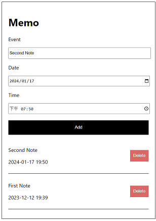

# Memo App

<p align="center">
   
</p>

## Description

This project uses Node.js and React.js and connects to a json-server database. Follow the steps below to set up the project.

## Setup


1. Install Node.js and npm on your local machine.

2. Clone the repository:

```bash
git clone https://github.com/JohnnyandLee/React_Memo
```

3. Navigate to the project directory:

```bash
cd React_Memo
```

4. Install the project dependencies:

```
npm install
```

5. Start the server:

```
npm run server
```


6. Start the App:

```
npm run start
```